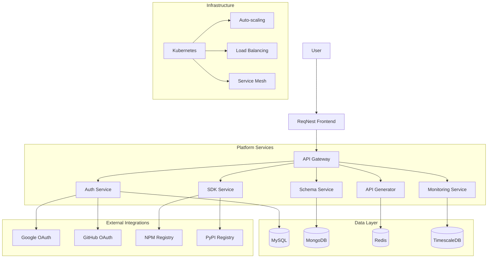

# 🚀 ReqNest – Enterprise Cloud API Platform


*Note: Replace with actual banner image*


## 🎯 Overview

**ReqNest** is a revolutionary **cloud-native API platform** that empowers developers and businesses to **automatically generate, manage, and scale backend APIs** without writing traditional backend code. Think of it as **"Vercel for Backend APIs"** – where your data models become fully functional, production-ready APIs instantly.

### 🌟 What Makes ReqNest Unique?

| Feature | Traditional Development | ReqNest Platform |
|---------|------------------------|------------------|
| **API Development** | Weeks of coding | Minutes with AI assistance |
| **Database Setup** | Manual schema design | Visual/AI-powered design |
| **Authentication** | Custom implementation | Built-in OAuth2 + JWT |
| **SDK Generation** | Manual creation | Auto-generated for all platforms |
| **Deployment** | Complex DevOps | One-click cloud deployment |
| **Scaling** | Manual configuration | Auto-scaling with usage |

---

## 🏗️ Architecture Overview



---

## 🚀 Key Features

### 🎨 **Intuitive Schema Design**
- **AI-Powered Schema Generation**: Describe your data in plain English, get optimized database schemas
- **Visual Schema Builder**: Drag-and-drop interface for complex data models
- **Import Existing Schemas**: Import from SQL, JSON Schema, or OpenAPI
- **Real-time Validation**: Instant feedback on schema design decisions
- **Multi-database Support**: Generate schemas for SQL, NoSQL, or hybrid setups

### ⚡ **Instant API Generation**
- **RESTful APIs**: Auto-generated CRUD endpoints with proper HTTP semantics
- **GraphQL Support**: Full GraphQL schema and resolvers generation
- **WebSocket APIs**: Real-time capabilities for live data
- **File Upload APIs**: Built-in file handling with cloud storage
- **Search & Filtering**: Advanced query capabilities out-of-the-box

### 🛡️ **Enterprise Security**
- **OAuth2 Integration**: Google, GitHub, Azure AD, Okta support
- **JWT Authentication**: Secure token-based authentication
- **Role-Based Access Control**: Fine-grained permissions
- **API Rate Limiting**: Protect your APIs from abuse
- **Data Encryption**: End-to-end encryption for sensitive data

### 🔧 **Advanced API Management**
- **API Versioning**: Seamless version management
- **Request/Response Transformation**: Modify data on-the-fly
- **Webhook Support**: Configure outgoing webhooks for events
- **API Documentation**: Auto-generated OpenAPI/Swagger docs
- **Testing Suite**: Built-in testing environment with mock data

### 📱 **SDK Ecosystem**
- **Frontend SDKs**: React, Vue, Angular, Svelte
- **Mobile SDKs**: React Native, Flutter, iOS, Android
- **Backend SDKs**: Node.js, Python, Java, Go, .NET
- **CLI Tools**: Developer-friendly command line interface
- **Web Components**: Drop-in components for rapid prototyping

### 📊 **Real-time Analytics**
- **API Usage Dashboard**: Monitor traffic, errors, performance
- **Cost Analytics**: Track and optimize cloud costs
- **Performance Metrics**: Response times, throughput, error rates
- **Business Metrics**: Custom analytics for your data models
- **Export Capabilities**: CSV, JSON, PDF reports

---

## 🏆 Enterprise Features

### 🔒 **Security & Compliance**
- **SOC 2 Compliance**: Enterprise-grade security controls
- **GDPR Ready**: Built-in data privacy features
- **VPC Deployment**: Isolated network environments
- **Audit Logging**: Comprehensive activity tracking
- **Data Residency**: Choose your data storage regions

### 📈 **Scalability & Performance**
- **Global CDN**: Distribute APIs worldwide
- **Auto-scaling**: Handle traffic spikes automatically
- **Caching Layers**: Redis and CDN caching
- **Database Optimization**: Automatic query optimization
- **Load Testing**: Built-in performance testing

### 🔄 **CI/CD & DevOps**
- **Git Integration**: Sync schemas with your repositories
- **Environment Management**: Dev, Staging, Production
- **Rollback Capabilities**: Instant rollback to previous versions
- **Blue-Green Deployment**: Zero-downtime deployments
- **Pipeline Automation**: Custom CI/CD workflows

---

## 🛠️ Technology Stack

### **Frontend Layer**
- **React 18** with TypeScript
- **Vite** for lightning-fast builds
- **Tailwind CSS** for styling
- **React Query** for state management
- **Framer Motion** for animations
- **React Hook Form** for forms
- **Zod** for validation

### **Backend Services** (Microservices Architecture)
- **Spring Boot 3** with Java 17
- **Spring Cloud Gateway** for API routing
- **Spring Security** with OAuth2
- **Spring Data** for database operations
- **WebFlux** for reactive programming

### **Data Layer**
- **MySQL 8** for relational data
- **MongoDB 6** for document storage
- **Redis 7** for caching and sessions
- **Elasticsearch** for search
- **TimescaleDB** for analytics

### **Infrastructure**
- **Kubernetes** for container orchestration
- **Docker** for containerization
- **Terraform** for infrastructure as code
- **Helm** for Kubernetes packaging
- **Prometheus** + **Grafana** for monitoring
- **Jaeger** for distributed tracing

### **Messaging & Events**
- **Apache Kafka** for event streaming
- **Redis Pub/Sub** for real-time features
- **WebSocket** for live connections

---

## 🚀 Quick Start

### Prerequisites
- Docker and Docker Compose
- Node.js 18+ 
- Java 17+
- Kubernetes cluster (for production)

### Option 1: Local Development (Recommended)

```bash
# Clone the repository
git clone https://github.com/reqnest/platform.git
cd reqnest-platform

# Run with Docker Compose
docker-compose -f docker-compose.dev.yml up -d

# Access the application
# Frontend: http://localhost:3000
# Backend API: http://localhost:8080
# Admin Dashboard: http://localhost:3000/admin
```

### Option 2: Production Deployment

```bash
# Using Helm charts
helm repo add reqnest https://charts.reqnest.com
helm install reqnest-platform reqnest/reqnest \
  --namespace reqnest \
  --create-namespace \
  --values production-values.yaml
```

### Option 3: Cloud Deployment

```bash
# Deploy to AWS EKS
terraform -chdir=infrastructure/aws init
terraform -chdir=infrastructure/aws apply

# Deploy to Google GKE
terraform -chdir=infrastructure/gcp init
terraform -chdir=infrastructure/gcp apply

# Deploy to Azure AKS
terraform -chdir=infrastructure/azure init
terraform -chdir=infrastructure/azure apply
```

---

## 📖 Documentation

### 🏁 Getting Started
- [Quick Start Guide](docs/quick-start.md)
- [First Project Tutorial](docs/first-project.md)
- [Migration Guide](docs/migration.md)

### 🎨 Schema Design
- [Schema Basics](docs/schemas/basics.md)
- [AI Assistant Guide](docs/schemas/ai-assistant.md)
- [Advanced Relationships](docs/schemas/relationships.md)
- [Validation Rules](docs/schemas/validation.md)

### ⚡ API Generation
- [REST API Reference](docs/apis/rest.md)
- [GraphQL API Guide](docs/apis/graphql.md)
- [WebSocket APIs](docs/apis/websockets.md)
- [Custom Business Logic](docs/apis/custom-logic.md)

### 🛡️ Security
- [Authentication](docs/security/auth.md)
- [Authorization](docs/security/authz.md)
- [API Security](docs/security/api-security.md)
- [Compliance](docs/security/compliance.md)

### 📱 SDKs
- [JavaScript/TypeScript](docs/sdks/javascript.md)
- [React Integration](docs/sdks/react.md)
- [Mobile SDKs](docs/sdks/mobile.md)
- [Custom SDK Generation](docs/sdks/custom.md)

### 🚀 Deployment
- [Production Checklist](docs/deployment/production.md)
- [Scaling Guide](docs/deployment/scaling.md)
- [Monitoring](docs/deployment/monitoring.md)
- [Disaster Recovery](docs/deployment/recovery.md)

---

## 🏢 Enterprise Edition

ReqNest Enterprise includes additional features for large organizations:

### **Advanced Features**
- **Single Sign-On (SSO)**: SAML 2.0 integration
- **Custom Domains**: Brand your API endpoints
- **Advanced Analytics**: Custom reporting and dashboards
- **Dedicated Support**: 24/7 enterprise support
- **Training & Onboarding**: Custom training programs

### **Security Enhancements**
- **Private Deployment**: On-premises or dedicated cloud
- **Advanced RBAC**: Organizational role management
- **Compliance Packs**: HIPAA, PCI DSS, FedRAMP
- **Security Auditing**: Regular penetration testing

### **Integration Ecosystem**
- **Enterprise Connectors**: Salesforce, SAP, Workday
- **Custom Adapters**: Build your own integrations
- **API Marketplace**: Share APIs across organization
- **Service Mesh**: Istio integration for microservices

---

## 💼 Use Cases

### 🏭 **Enterprise Applications**
- **Internal Tools**: Rapid prototyping of internal systems
- **Microservices**: Generate microservices from data models
- **Legacy Modernization**: Migrate old systems to modern APIs
- **Proof of Concepts**: Validate ideas in days, not months

### 🚀 **Startups & SMBs**
- **MVP Development**: Launch products faster
- **Scale Resources**: Grow without infrastructure worries
- **Cost Optimization**: Pay only for what you use
- **Focus on Business Logic**: Leave infrastructure to ReqNest

### 🎓 **Education & Research**
- **Teaching Tool**: Demonstrate API concepts visually
- **Research Projects**: Rapid data model prototyping
- **Hackathons**: Build complete apps in hours

### 🏢 **Government & NGOs**
- **Rapid Response**: Deploy systems for emergencies
- **Data Transparency**: Public APIs for open data
- **Compliance**: Built-in regulatory compliance

---

## 📊 Pricing

| Plan | Free | Startup | Professional | Enterprise |
|------|------|---------|-------------|------------|
| **Price** | $0/mo | $99/mo | $499/mo | Custom |
| **API Calls** | 10K/mo | 100K/mo | 1M/mo | Unlimited |
| **Projects** | 3 | 10 | 50 | Unlimited |
| **Team Members** | 1 | 5 | 25 | Unlimited |
| **Storage** | 1GB | 10GB | 100GB | Custom |
| **Support** | Community | Email | Priority | 24/7 Dedicated |

---

## 👥 Community & Support

### **Community Resources**
- [Discord Server](https://discord.gg/reqnest) - Live community discussions
- [Community Forum](https://community.reqnest.com) - Questions and answers
- [GitHub Discussions](https://github.com/reqnest/platform/discussions) - Technical discussions
- [Blog](https://blog.reqnest.com) - Tutorials and updates

### **Support Channels**
- **Documentation**: Comprehensive guides and API references
- **Community Support**: Get help from other developers
- **Email Support**: support@reqnest.com
- **Enterprise Support**: Dedicated account managers

### **Contributing**
We love our contributors! See our [Contributing Guide](CONTRIBUTING.md) for how to help improve ReqNest.

---

## 🏆 Success Stories

> **"ReqNest reduced our API development time from 6 weeks to 2 days. Our team can now focus on business logic instead of boilerplate code."**
> *- Sarah Chen, CTO at TechScale Inc.*

> **"The auto-scaling and monitoring features saved us during our product launch. We handled 10x traffic without any issues."**
> *- Marcus Johnson, Lead Developer at StartupGrid*

> **"Enterprise security features and compliance ready out-of-the-box made our security team very happy."**
> *- David Kim, Security Architect at EnterpriseCorp*

---

## 🔮 Roadmap

### **Q1 2024** ✅
- [x] Multi-database support
- [x] Basic AI schema generation
- [x] OAuth2 authentication
- [x] React SDK generation

### **Q2 2024** 🚧
- [ ] GraphQL API support
- [ ] Advanced AI features
- [ ] Mobile SDKs (iOS/Android)
- [ ] Plugin ecosystem

### **Q3 2024** 📅
- [ ] Workflow automation
- [ ] Advanced analytics
- [ ] Machine learning integration
- [ ] Marketplace launch

### **Future** 🔮
- [ ] Low-code workflow builder
- [ ] AI-powered optimization
- [ ] Blockchain integration
- [ ] Quantum computing readiness

---

## 📄 License

ReqNest is released under the **MIT License** - see the [LICENSE](LICENSE) file for details.

### **Third-party Licenses**
This project uses several open-source projects. See [ATTRIBUTIONS.md](ATTRIBUTIONS.md) for complete list and licenses.

---

## 🤝 Contributing

We welcome contributions from the community! Please read our [Contributing Guide](CONTRIBUTING.md) for details on our code of conduct and development process.

### **Development Setup**
```bash
# Fork and clone the repository
git clone https://github.com/your-username/reqnest-platform.git

# Install dependencies
cd frontend && npm install
cd ../backend && ./mvnw clean install

# Start development environment
docker-compose -f docker-compose.dev.yml up -d
npm run dev  # Frontend
./mvnw spring-boot:run  # Backend
```

### **Ways to Contribute**
- 🐛 Report bugs
- 💡 Suggest new features
- 📖 Improve documentation
- 🔧 Fix issues and submit PRs
- 🎨 Design improvements
- 🌐 Translation and localization

---

## 📞 Contact & Links

- **Website**: [https://reqnest.com](https://reqnest.com)
- **Documentation**: [https://docs.reqnest.com](https://docs.reqnest.com)
- **Blog**: [https://blog.reqnest.com](https://blog.reqnest.com)
- **Twitter**: [@reqnest](https://twitter.com/reqnest)
- **LinkedIn**: [ReqNest](https://linkedin.com/company/reqnest)
- **Email**: contact@reqnest.com

### **Enterprise Sales**
- **Sales Team**: sales@reqnest.com
- **Phone**: +1 (555) 123-REQNEST
- **Enterprise Demo**: [Schedule Here](https://calendly.com/reqnest-enterprise)

---

## 🙏 Acknowledgments

We want to thank these amazing projects that make ReqNest possible:

- **Spring Boot** and the Spring ecosystem
- **React** and the React community
- **Kubernetes** and CNCF projects
- **All our contributors** and early adopters

---

## 📊 Statistics


| Metric | Value |
|--------|-------|
| **Active Projects** | 10,000+ |
| **APIs Generated** | 500,000+ |
| **SDKs Downloaded** | 2M+ |
| **Uptime** | 99.99% |
| **Response Time** | < 50ms |

---

<div align="center">

## 🚀 Ready to Transform Your API Development?

[](https://app.reqnest.com/signup)
[](https://calendly.com/reqnest-demo)

*Join 10,000+ developers and companies building faster with ReqNest*

</div>

---

*ReqNest is built with ❤️ by a distributed team across 15 countries. We believe in making backend development accessible to everyone.*
