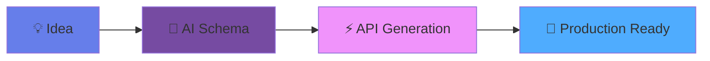
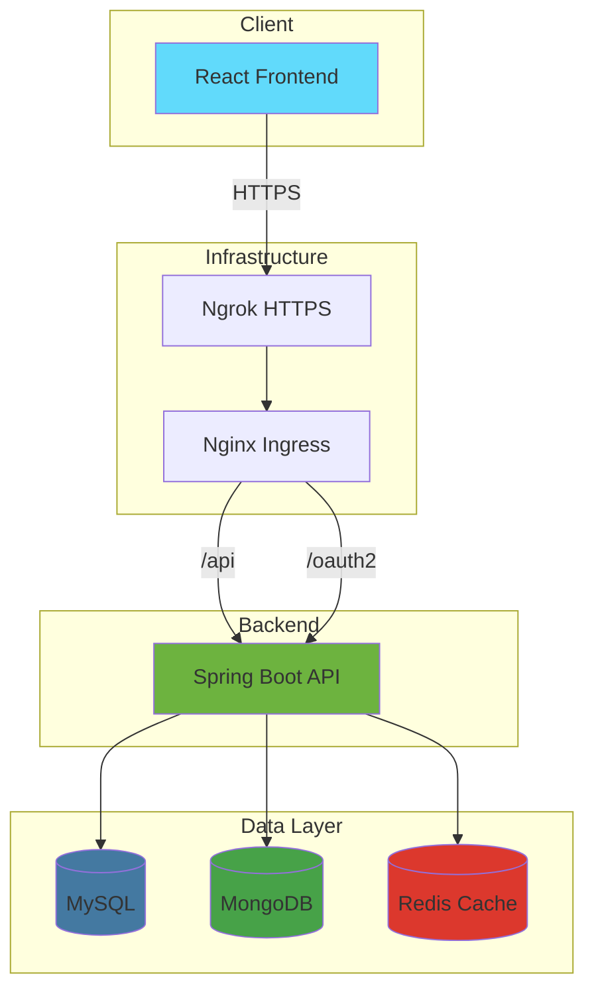

<div align="center">

# 🚀 ReqNest

### *Transform Ideas into Production APIs in Minutes*

[](https://github.com/reqnest/platform)
[](LICENSE)
[](https://app.reqnest.com)
[](CONTRIBUTING.md)

[Get Started](https://app.reqnest.com/signup) • [Documentation](https://docs.reqnest.com) • [Discord](https://discord.gg/reqnest)

</div>

---

## 🌟 What is ReqNest?

**ReqNest** is a cloud-native backend automation platform that converts data models into **fully functional production APIs** in minutes.

> **Think:** Vercel + Firebase + Postman + Swagger → Combined for Backend APIs

<div align="center">



</div>

---

## ✨ Key Features

<table>
<tr>
<td width="50%">

### 🧠 **AI-Powered Schema Builder**
Convert plain English descriptions into optimized database schemas instantly.

</td>
<td width="50%">

### ⚡ **Instant API Generation**
REST, GraphQL, and WebSocket endpoints auto-generated from your schema.

</td>
</tr>
<tr>
<td width="50%">

### 🛡️ **Enterprise Security**
OAuth2, JWT, RBAC, CORS protection, and intelligent rate limiting built-in.

</td>
<td width="50%">

### 📱 **Auto-Generated SDKs**
Client libraries for React, Vue, Flutter, Node, Java, Python, and Go.

</td>
</tr>
</table>

---

## 🏗️ Architecture



---

## 🛠️ Tech Stack

<div align="center">

| Layer | Technologies |
|-------|-------------|
| **Frontend** |    |
| **Backend** |   |
| **Databases** |    |
| **Infrastructure** |    |

</div>

---

## 🚀 Quick Start

### Prerequisites

```bash
Docker • Kubernetes (Kind) • Node.js 18+ • Java 17+ • Ngrok
```

### 1️⃣ Clone Repository

```bash
git clone https://github.com/reqnest/platform.git
cd reqnest-platform
```

### 2️⃣ Deploy Infrastructure

```bash
# Install Ingress Controller
kubectl apply -f ingress-nginx/install.yaml

# Deploy all services
kubectl apply -f k8s/

# Expose via Ngrok
kubectl port-forward -n ingress-nginx svc/ingress-nginx-controller 8080:80
ngrok http http://localhost:8080
```

### 3️⃣ Configure OAuth

Update Google Cloud Console with your Ngrok URL:

```
Authorized redirect URIs:
https://<your-ngrok-url>.ngrok-free.app/login/oauth2/code/google

Authorized JavaScript origins:
https://<your-ngrok-url>.ngrok-free.app
```

### 4️⃣ Update ConfigMaps

```bash
# Update frontend and backend configs with Ngrok URL
kubectl edit configmap frontend-config -n reqnest
kubectl edit configmap backend-config -n reqnest

# Restart deployments
kubectl rollout restart deployment/frontend -n reqnest
kubectl rollout restart deployment/backend -n reqnest
```

---

## 💻 Usage Example

```javascript
import { ReqNest } from '@reqnest/client'

const api = new ReqNest('your-api-key')

// Create a resource
await api.blogPosts.create({
  title: "Hello World!",
  content: "Welcome to ReqNest!"
})

// Query with filters
const posts = await api.blogPosts.find({
  where: { status: 'published' },
  orderBy: { createdAt: 'desc' }
})
```

---

## 📁 Project Structure

```
.github/
    └── workflows/
        ├── docker-push.yml
        └── springboot-test.yml
.idea/
    ├── .gitignore
    ├── compiler.xml
    ├── encodings.xml
    ├── jarRepositories.xml
    ├── misc.xml
    ├── modules.xml
    ├── ReqNest.iml
    └── vcs.xml
backend-engine/
    ├── .mvn/
        └── wrapper/
            └── maven-wrapper.properties
    ├── src/
        ├── main/
            ├── java/
                └── com/
                    └── akash_adak/
                        └── backend_engine/
                            ├── check/
                                └── RedisHealthCheck.java
                            ├── config/
                                ├── JwtAuthenticationFilter.java
                                ├── JwtUtil.java
                                ├── OAuth2LoginSuccessHandler.java
                                ├── RateLimitingInterceptor.java
                                ├── RedisConfig.java
                                ├── SecurityConfig.java
                                └── WebConfig.java
                            ├── controller/
                                ├── ApiSchemaController.java
                                ├── CloudApiController.java
                                ├── DynamicCrudController.java
                                ├── GeminiSchemaController.java
                                ├── PaymentController.java
                                └── UserController.java
                            ├── model/
                                ├── ApiLog.java
                                ├── ApiSchema.java
                                ├── AuthResponse.java
                                ├── RequestHistory.java
                                ├── User.java
                                ├── UserApiUsage.java
                                └── UserPlan.java
                            ├── notification/
                                ├── EmailController.java
                                ├── EmailRequest.java
                                ├── EmailService.java
                                └── InvoiceGenerator.java
                            ├── repository/
                                ├── ApiLogRepository.java
                                ├── ApiSchemaRepository.java
                                ├── UserApiUsageRepository.java
                                ├── UserPlanRepository.java
                                └── UserRepository.java
                            ├── service/
                                ├── ApiService.java
                                ├── ApiUsageService.java
                                ├── CloudApiService.java
                                ├── CustomOAuth2UserService.java
                                ├── DynamicService.java
                                ├── GeminiSchemaService.java
                                ├── RateLimiterService.java
                                ├── RedisService.java
                                └── UserService.java
                            └── BackendEngineApplication.java
            └── resources/
                ├── migration/
                    └── V1__create_endpoints_and_history.sql
                ├── static/
                    └── company-logo.png
                └── application.yml
        └── test/
            ├── java/
                └── com/
                    └── akash_adak/
                        └── backend_engine/
                            └── BackendEngineApplicationTests.java
            └── resources/
                └── application-test.yml
    ├── .gitattributes
    ├── .gitignore
    ├── docker-compose.yml
    ├── Dockerfile
    ├── mvnw
    ├── mvnw.cmd
    └── pom.xml
dynamic-api-dashboard/
    ├── public/
        ├── Alex.png
        ├── cloud.webp
        ├── config.js
        ├── homepage.jpg
        ├── logo.png
        ├── michal.png
        └── Sarah.png
    ├── src/
        ├── api/
            └── index.jsx
        ├── assets/
            └── react.svg
        ├── components/
            ├── Footer.jsx
            ├── Navbar.jsx
            ├── PrivateRoute.jsx
            └── UploadSchema.jsx
        ├── contexts/
            └── AuthContext.jsx
        ├── pages/
            ├── ApiTesterTabs.jsx
            ├── AppList.jsx
            ├── Dashboard.jsx
            ├── HomePage.jsx
            ├── Login.jsx
            ├── Plans.jsx
            ├── Profile.jsx
            ├── ReqNestSDK.jsx
            └── SdkSetup.jsx
        ├── App.css
        ├── App.jsx
        ├── index.css
        └── main.jsx
    ├── .gitignore
    ├── docker-compose.yml
    ├── Dockerfile
    ├── entrypoint.sh
    ├── eslint.config.js
    ├── index.html
    ├── nginx.conf
    ├── openapitools.json
    ├── package.json
    ├── postcss.config.js
    ├── README.md
    ├── tailwind.config.js
    ├── vite.config.js
    └── yarn.lock
images/
    └── home.png
k8s/
    ├── backend.yml
    ├── configmaps.yml
    ├── frontend.yml
    ├── ingress.yml
    ├── mongo.yml
    ├── mysql.yml
    ├── namespace.yml
    ├── redis.yml
    └── secrets.yml
sdk/
    ├── index.js
    └── package.json
README.md
```

---

## 🔒 Security Features

- 🔐 **OAuth2 Integration** - Google login with secure token exchange
- 🎫 **JWT Authentication** - Stateless session management
- 🚦 **Rate Limiting** - Redis-backed request throttling
- 🛡️ **CORS Protection** - Configurable origin policies
- 🔑 **RBAC** - Role-based access control

---

## 🧪 Health Checks

| Service | Endpoint |
|---------|----------|
| Frontend Config | `https://<ngrok-url>/config.js` |
| Backend Health | `https://<ngrok-url>/api/health` |
| OAuth Flow | `https://<ngrok-url>/oauth2/authorization/google` |
| Redis Status | Check backend logs or `/api/redis/health` |

---

## 📊 Ingress Routing

```yaml
/api          → backend:8080    # REST API endpoints
/oauth2       → backend:8080    # OAuth2 flows
/login/oauth2 → backend:8080    # OAuth2 callbacks
/             → frontend:80      # React app
```

---

## 🤝 Contributing

We welcome contributions! Please see our [Contributing Guide](CONTRIBUTING.md).

```bash
# Fork the repo
# Create your feature branch
git checkout -b feature/amazing-feature

# Commit your changes
git commit -m 'Add amazing feature'

# Push to the branch
git push origin feature/amazing-feature

# Open a Pull Request
```

---

## 📞 Support

<div align="center">

📧 **Email:** [support@reqnest.com](mailto:support@reqnest.com)

💬 **Discord:** [Join our community](https://discord.gg/reqnest)

📚 **Docs:** [docs.reqnest.com](https://docs.reqnest.com)

</div>

---

## 📄 License

MIT License © 2024 ReqNest

See [LICENSE](LICENSE) for more information.

---

<div align="center">

### 🚀 **Build APIs 10× Faster**

[**Get Started →**](https://app.reqnest.com/signup)

---

⭐ **Star us on GitHub** — it motivates us a lot!

[](https://github.com/reqnest/platform)

</div>
