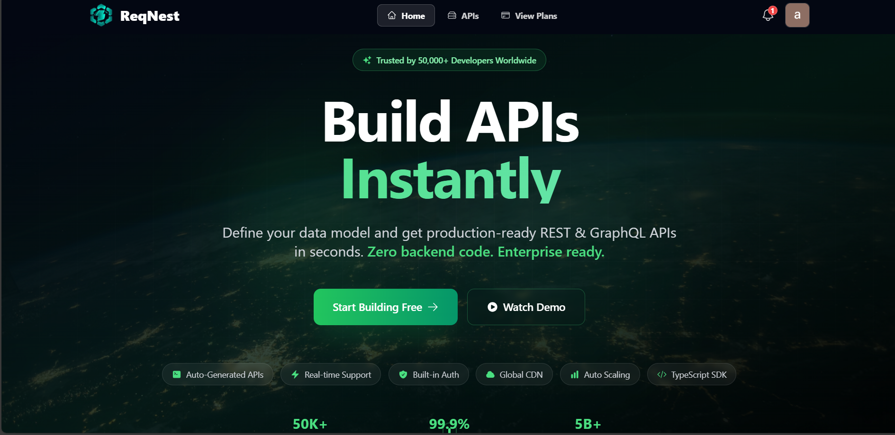

<div align="center">

# 🚀 ReqNest

### *Transform Ideas into Production APIs in Minutes*


</div>



---

## 🎬 What is ReqNest?

ReqNest is a revolutionary cloud-native API platform that empowers developers and businesses to automatically generate, manage, and scale backend APIs without writing traditional backend code. Think of it as "Vercel for Backend APIs" – where your data models become fully functional, production-ready APIs instantly.

<table>
<tr>
<td width="50%">

### 🐌 Traditional Way
```bash
Week 1: Setup infrastructure
Week 2: Write CRUD operations
Week 3: Add authentication
Week 4: Generate documentation
Week 5: Deploy & scale
Week 6: SDK generation
```
⏰ **6 weeks** • 😫 Exhausting

</td>
<td width="50%">

### ⚡ ReqNest Way
```bash
Step 1: Design schema (AI-assisted)
Step 2: Click "Generate API"
Step 3: Deploy
```
⏱️ **10 minutes** • 🎉 Production-ready

</td>
</tr>
</table>

---

## ✨ Why Developers Love ReqNest

<div align="center">

| 🎨 **AI-Powered Design** | ⚡ **Instant APIs** | 🛡️ **Enterprise Security** | 📱 **Full SDK Suite** |
|:---:|:---:|:---:|:---:|
| Describe in plain English, get optimized schemas | REST, GraphQL, WebSocket—all auto-generated | OAuth2, JWT, RBAC out of the box | React, Vue, Flutter, iOS, Android |

</div>

---

## 🎯 Quick Start

### 📦 One-Click Deploy

```bash
# Docker Compose (Fastest)
curl -fsSL https://get.reqnest.com | bash
# Opens at http://localhost:3000 ✨

# Or with Kubernetes
helm install reqnest reqnest/reqnest

# Or cloud deploy
terraform apply -chdir=infrastructure/aws
```

### 🎪 Your First API in 3 Steps

```javascript
// 1️⃣ Define your schema (or use AI)
const schema = {
  name: "BlogPost",
  fields: {
    title: { type: "string", required: true },
    content: { type: "text" },
    author: { type: "reference", to: "User" },
    tags: { type: "array", items: "string" }
  }
}

// 2️⃣ Generate API (automatic)
// ✅ CRUD endpoints created
// ✅ Authentication added
// ✅ Documentation generated
// ✅ SDKs ready

// 3️⃣ Use it immediately
import { ReqNest } from '@reqnest/client'
const api = new ReqNest('your-api-key')
await api.blogPosts.create({ title: "Hello World!" })
```

---

## 🎨 Features That Make You Go "WOW"

### 🤖 AI-Powered Schema Builder
```
You: "I need a schema for an e-commerce store"
ReqNest AI: ✨ Generated:
  ├── Product (name, price, inventory, images)
  ├── Category (name, parent, slug)
  ├── Order (items, customer, status, payment)
  ├── Customer (profile, addresses, orders)
  └── Payment (method, amount, status, transaction_id)
  
  Optimized with indexes, relationships, and validations!
```

### ⚡ Instant API Generation

<table>
<tr><td>

**REST API**
```http
GET    /api/v1/products
POST   /api/v1/products
GET    /api/v1/products/:id
PUT    /api/v1/products/:id
DELETE /api/v1/products/:id
```

</td><td>

**GraphQL API**
```graphql
query {
  products(limit: 10) {
    id, name, price
    category { name }
    reviews { rating }
  }
}
```

</td><td>

**WebSocket API**
```javascript
ws://api/live/products
// Real-time updates
// Push notifications
// Live queries
```

</td></tr>
</table>

### 🔐 Security That Just Works

```yaml
Authentication:
  ✓ OAuth2 (Google, GitHub, Azure)
  ✓ JWT with refresh tokens
  ✓ API keys & webhooks
  ✓ 2FA support

Authorization:
  ✓ Role-based access (RBAC)
  ✓ Resource-level permissions
  ✓ Rate limiting
  ✓ IP whitelisting

Compliance:
  ✓ SOC 2 certified
  ✓ GDPR ready
  ✓ HIPAA compliant
  ✓ End-to-end encryption
```

### 📱 SDK for Every Platform

<div align="center">

| Frontend | Mobile | Backend | CLI |
|:--------:|:------:|:-------:|:---:|
| ⚛️ React | 📱 React Native | 🟢 Node.js | 💻 CLI Tool |
| 💚 Vue | 🎨 Flutter | 🐍 Python | 🔧 VS Code |
| 🅰️ Angular | 🍎 iOS Native | ☕ Java | 📦 npm pkg |
| 🔶 Svelte | 🤖 Android | 🔵 Go | 🐙 GitHub |

**Auto-generated • Type-safe • Always in sync**

</div>

---

## 📊 Real-Time Analytics Dashboard

```
┌─────────────────────────────────────────────────┐
│  📈 API Performance        🔥 Hot Today         │
├─────────────────────────────────────────────────┤
│  Requests:  1.2M ↑ 23%    Top Endpoint:         │
│  Latency:   45ms ↓ 12%    /api/products  (45%)  │
│  Errors:    0.02% ✓       Cache Hit:    89%     │
│  Uptime:    99.99% ✓      Countries:    127     │
└─────────────────────────────────────────────────┘
```

---

## 🚀 Tech Stack

<div align="center">

### Frontend


### Backend


### Data


### Infrastructure


</div>

---

## 💎 Pricing

<div align="center">

| | **🆓 Free** | **🚀 Startup** | **💼 Pro** | **🏢 Enterprise** |
|:---:|:---:|:---:|:---:|:---:|
| **Price** | $0 | $99/mo | $499/mo | Custom |
| **API Calls** | 10K | 100K | 1M | ♾️ Unlimited |
| **Projects** | 3 | 10 | 50 | ♾️ Unlimited |
| **Team** | 1 | 5 | 25 | ♾️ Unlimited |
| **Storage** | 1GB | 10GB | 100GB | Custom |
| **Support** | Community | Email | Priority ⚡ | 24/7 Dedicated 🎯 |
| **SLA** | - | 99.9% | 99.95% | 99.99% |

[Start Free →](https://app.reqnest.com/signup) No credit card required

</div>

---

## 💬 What People Are Saying

<table>
<tr>
<td width="33%">

### ⭐⭐⭐⭐⭐
> "Reduced API dev from **6 weeks to 2 days**. Mind-blowing!"

**Sarah Chen**  
*CTO @ TechScale*

</td>
<td width="33%">

### ⭐⭐⭐⭐⭐
> "Handled **10x traffic** during launch without breaking a sweat."

**Marcus Johnson**  
*Lead Dev @ StartupGrid*

</td>
<td width="33%">

### ⭐⭐⭐⭐⭐
> "Security team approved it **in one meeting**. That's a first!"

**David Kim**  
*Security Architect*

</td>
</tr>
</table>

---

## 📈 Stats That Matter

<div align="center">

```
🎯 10,000+        ⚡ 500,000+        📦 2M+            ⚙️ 99.99%
Active Projects   APIs Generated     SDKs Downloaded   Uptime

🚀 <50ms         💰 $250K+          🌍 127            ⭐ 10K+
Avg Response     Saved in Dev       Countries         GitHub Stars
```

</div>

---

## 🗺️ Roadmap


---

## 🤝 Contributing

We ❤️ contributors! Here's how you can help:

<div align="center">

| 🐛 **Report Bugs** | 💡 **Ideas** | 📖 **Docs** | 💻 **Code** |
|:---:|:---:|:---:|:---:|
| [Open Issue](https://github.com/reqnest/platform/issues) | [Discussions](https://github.com/reqnest/platform/discussions) | [Edit Docs](https://github.com/reqnest/docs) | [Send PR](https://github.com/reqnest/platform/pulls) |

</div>

```bash
# Quick Setup
git clone https://github.com/reqnest/platform.git
cd reqnest-platform
docker-compose up -d
npm run dev
```

---


## 📞 Get In Touch

<div align="center">

[](https://reqnest.com)
[](https://docs.reqnest.com)
[](https://discord.gg/reqnest)
[](https://twitter.com/reqnest)

**Enterprise?** sales@reqnest.com | +1 (555) 123-REQNEST

</div>

---

## 📄 License

MIT License - see [LICENSE](LICENSE) for details.

---

<div align="center">

### 🚀 Ready to 10x Your API Development?

[](https://app.reqnest.com/signup)
[](https://calendly.com/reqnest-demo)

**Join 10,000+ developers building the future, faster.**

---

*Made with ❤️ by developers, for developers, across 15 countries*

[](https://github.com/reqnest/platform)
[](https://twitter.com/reqnest)

</div>